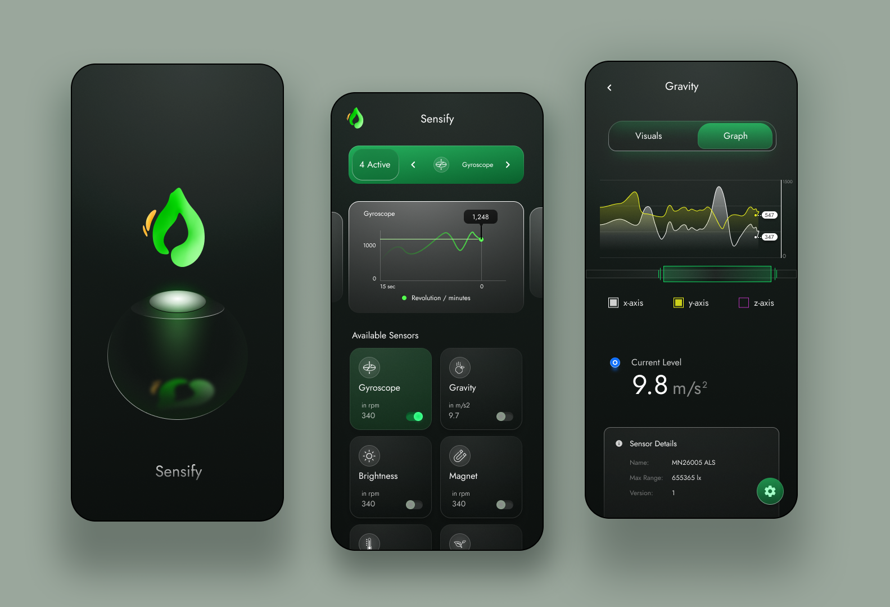

# Sensify : Android Sensor Visualizer

> Help in analysing your Android phone's sensors with graphs and visuals.

## [Download it on Google Play here](https://play.google.com/store/apps/details?id=io.sensify.sensor)

## Feature Roadmap
- 2022: configure sensor delay
- 2023: Beautiful Visuals of for each sensors.

## Goals
- A very good UI for user to interact.
- Use of android sensors for different utilities.
- [Use Cases](https://github.com/JunkieLabs/sensify-android/wiki/Use-Cases)

## Features:

Whole sensors functionality is implemented inside domain folder, where SensorProvider used for listing available sensors and SensorPacketProvider for get packets .

* Realtime **sensor outputs** into charts.
* Implemented in Jetpack Compose.
* MVVM Architecture used for this App.
* Usage of Kotlin Flow, Jetpack State, Singletons etc.
* Theming in M3 for Light and Dark.
* compatible with **Wear Os** with similar features

## Organization of code and the libraries:

### Code
* whole code is in **Kotlin** 
* the phone app follows **MVVM architecture** - pages -> ViewModel -> domain
* Resource folder inside ui is dedicated to theming and styling. 

 

## Show your love :heart: by giving a :star: on this project.

 

 

# FAQ
Please see in [the wiki](https://github.com/JunkieLabs/sensify-android/wiki/Frequently-Asked-Questions-(FAQ))

# Open Source Credits

- Charts: [MpAndroidChart](https://github.com/PhilJay/MPAndroidChart)
- Thank you to everyone who tried out this app and opened issues, suggested features, provided translations, or tested debug builds for me
- Thanks to @KunwarManish2008 for helping in several features

# License

- **[MIT license](LICENSE)**
